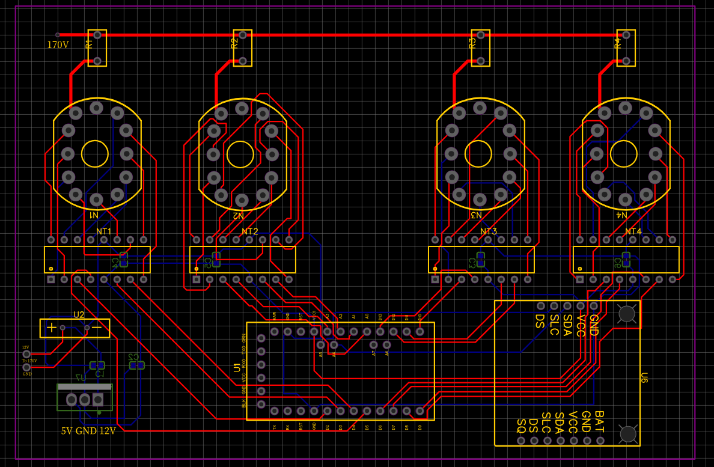

# Nixie Tube Clock Documentation
Here is the documentation of how the project was created.

This project was heavily based on a youtuber's nixie tube clock.

Credit: GreatScott!
https://www.youtube.com/watch?v=ObgmVNV1Kfg 

## Process of Designing
First steps I started with creating a PCB which was essentially GreatScott's PCB but then retrofitted so that it fits with the parts that I have at hand.

From this original schematic there were a couple changes that I had to make while designing the PCB. I had changed a couple of the outputs for the IC drivers so that routing for the PCB was a lot easier, and I had also changed the resistors for the nixie tubes to be 20K ohms, so that it can sustain the 2.5mA as 10K actually provides it way too much current. Also in the final design, I decided for better visability, I connected the filtering capacitors to ground and to the input/output just so that following the schematic would be easier.

After Completing the Schematic I then started with designing the PCB and placing them in the correct spots.

Here is the raw PCB without traces, copper layers added, and correct measurements or placement for the parts. 

This is what the PCB looks like after I have routed all of the traces.

After which I then added the copper layers for GND net and 5V net

## Building the Physical Circuit

I then started to test the components to make sure they work. In this picture I built a simple circuit to test the bulb by using my step up voltage converter to bring my 12V DC power supply to 170V. I also soldered on a 10K resistor as the operating voltage of the bulb needs to be a minimum 120V while the firing voltage is 170V. The resistor there is to save some power, as I don't constantly want to use 170V to save on power.  
 

I also tested to see if the K155ID1 driver ICs were working, which I hooked up my arduino to the IC, then programmed it to test if selecting the number 1 worked, which it did as I saw that on that pin it drove the voltage down. The way that I can select numbers is based off of a truth table as seen below.

